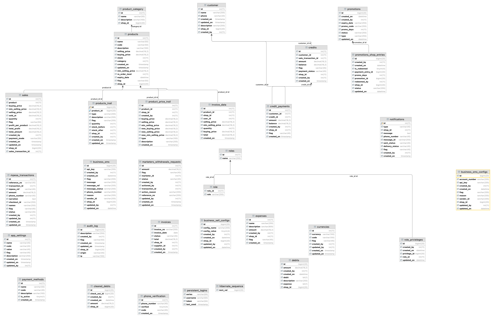

**Database Design**

**Api documentation url swagger**

http://localhost:8080/swagger-ui.html#/api-supplier-controller/suppliersListUsingGET

**Postman collection this can be imported to run sanity test**
[inventory.postman_collection.json](..%2F..%2F..%2F..%2FDownloads%2Finventory.postman_collection.json)

How run the application
*     Prerequisites
*     jdk 11
*     maven
*     mysql

How to run project
* run  db scripts
[database_structure.sql](src%2Fmain%2Fresources%2Fdb%2Fdatabase_structure.sql)
[data_script.sql](src%2Fmain%2Fresources%2Fdb%2Fdata_script.sql)

Go to property file and change db connection string host, username, password and schema

How to run on kubernates
* Build docker image (in Dockerfile)
* Then run file in k8 folder
